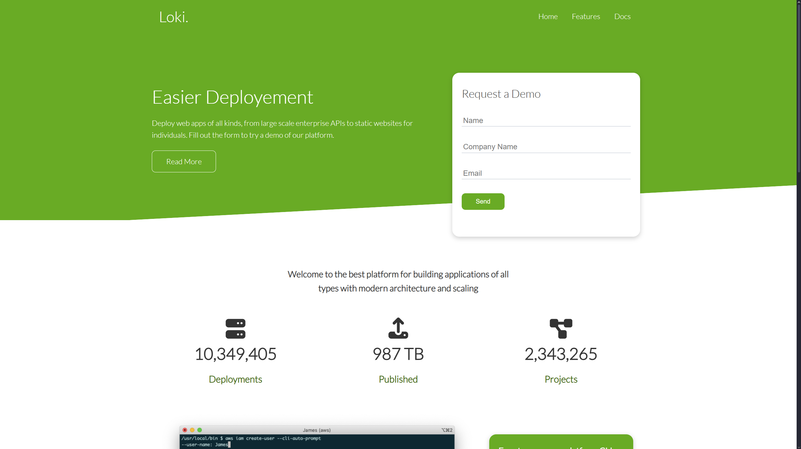
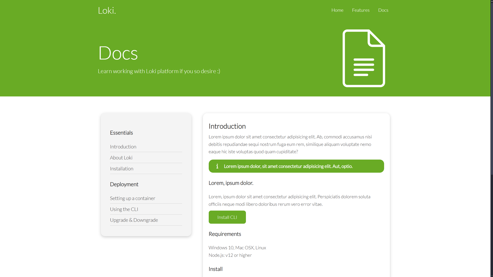

# Loki-Responsive-Website

Loki. is a static, responsive multi-page mock landing site for a fictional cloud hosting platform. It includes a homepage with a demo request form and showcase sections, a features page highlighting service cards with icons, and a docs page structured like developer documentation with navigable side sections and install snippets. Built with semantic HTML, reusable utility and style CSS, Font Awesome icons, grid/flex layouts, and placeholder content, it simulates a modern hosting provider’s marketing and onboarding experience.

[Click to view the website](https://adyan5786.github.io/Loki-Responsive-Website/templates/index.html)

## Features:
- **Layout:** Responsive multi-page (Home, Features, Docs)
- **Form:** Demo request form
- **Stats:** Showcase statistics section
- **CLI:** Command-line interface highlight
- **Cloud:** Cloud hosting highlight section
- **Languages:** Supported language display cards
- **Icons:** Icon-based feature cards
- **Docs:** Documentation page with side navigation, alert, code snippets, and requirements

## Languages Used:
- **HTML**
- **CSS**

## Screenshots

Home Page
 

Features Page
 

Docs Page
 
